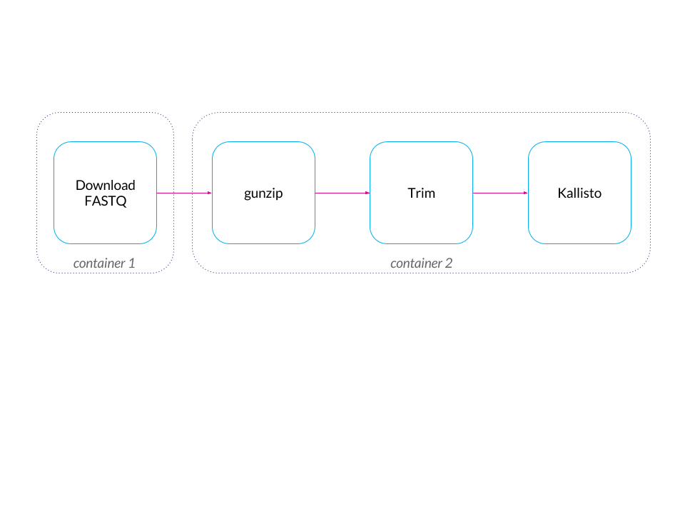

# Overview

Launches kubernetes jobs to download and process FASTQ files:



This is used by `hammmerlab/immune-infiltrate-explorations`.


# Runbook

## Set up NFS for reading and writing data

Launch a [single-node NFS server](https://cloud.google.com/launcher/solution/click-to-deploy-images/singlefs). I called it `mz-nfs-vm` and went with 8 vCPU, 40 GB RAM.

Here's how to monitor it:

* `gcloud compute ssh --ssh-flag=-L3000:localhost:3000 --project=pici-1286 --zone us-east1-b mz-nfs-vm`
* go to http://localhost:3000/ for the Grafana dashboard
* login with admin / X*QZcMsf3Y29nS (the password is given to you when you deploy your own `singlefs` in the deployment details)
* if you ssh in, the data is at `/mz-data`

Here's how to mount the NFS into a GCE VM:

```
sudo apt-get install nfs-common
sudo mkdir /mnt/mz-data
sudo chmod a+w /mnt/mz-data
echo 'mz-nfs-vm:/mz-data /mnt/mz-data nfs rw 0 0' | sudo tee -a /etc/fstab
sudo mount -t nfs mz-nfs-vm:/mz-data /mnt/mz-data
```

Next, we must download the proper Kallisto index into the NFS. I executed this line from `mz-nfs-vm`: 

```
gsutil cp gs://mz-hammerlab/index/Homo_sapiens.GRCh38.cdna.all.kallisto.idx /mz-data/
```


Create a cluster in Kubernetes. Below I suppose it's called `some-cluster`. You can create it from the Cloud Console (web UI) or from command line like this:

```
gcloud container --project "pici-1286" clusters create "some-cluster" \
    --zone "us-east1-b" --machine-type "n1-highmem-4" \
    --scope "https://www.googleapis.com/auth/compute","https://www.googleapis.com/auth/devstorage.read_write","https://www.googleapis.com/auth/taskqueue","https://www.googleapis.com/auth/logging.write","https://www.googleapis.com/auth/servicecontrol","https://www.googleapis.com/auth/service.management" \
    --num-nodes "5" --network "default" --enable-cloud-logging --no-enable-cloud-monitoring;
```

See cluster details:

```
kubectl cluster-info
kubectl config view
```

Set up persistent volume in Kubernetes. First, modify `nfs/nfs-pv.yaml` to have the right NFS VM name. Then execute these commands:

```
gcloud container clusters get-credentials some-cluster
kubectl create -f nfs/nfs-pv.yaml # persistent volume
kubectl create -f nfs/nfs-pvc.yaml # persistent volume claim
```

## First set of containers/jobs: downloading data

Build, test, and publish image to Google Container Registry (Docker must be installed):

```
cd get_data
./build.sh
./test.sh
./publish_image.sh
```

(Note, I ran the above from a GCE VM, but you can do it locally as well.)

The image is based on the containers from [*A cloud-based workflow to quantify transcript-expression levels in public cancer compendia*](http://discourse.hammerlab.org/t/a-cloud-based-workflow-to-quantify-transcript-expression-levels-in-public-cancer-compendia/559), except with custom shell scripts dropped in. The original containers are in `original_containers_from_paper`.

Create Kubernetes jobs from a YAML template, and launch them:

```
rm jobs/*
python make_jobs.py # creates files in jobs/ from template.yaml and ../list_of_data.txt
kubectl create -f ./jobs
kubectl get jobs | wc -l # should be 127 with header; subtract one = 126
wc -l ../list_of_data.txt # should be 126
```

Monitor:

* http://localhost:3000/dashboard/db/storage on NFS VM
* http://localhost:3000/dashboard/db/system
* https://104.196.139.139/api/v1/proxy/namespaces/kube-system/services/kubernetes-dashboard -- web UI from kubectl cluster details

```
kubectl get jobs
kubectl get pods
kubectl describe jobs/download-err431606-1
```

When done, clean up: `kubectl delete jobs --all`.

Note that logs get garbage collected quickly (a known issue):

```
kubectl get pods -a
> ...
> download-err431623-2-52tlr   0/1       Completed   0          1h
> download-err431623-2-rds71   0/1       Error       0          2h
> ...
kubectl logs download-err431623-2-52tlr --previous
> Error from server: previous terminated container "download-err431623-2" in pod "download-err431623-2-52tlr" not found
```


## Second set of containers/jobs: process.

Same procedure:

```
cd process/
# ran these on GCE VM
./build.sh
./test.sh
./publish_image.sh

# ran these from local machine
rm jobs/*
python make_jobs.py
kubectl create -f ./jobs
kubectl get jobs | grep 'process' | wc -l # should be 63 = 126/2 -- one job per pair of paired-end reads.
wc -l ../list_of_data.txt # 126
```


# Gotchas

I experienced a weird NFS bug where I could no longer write to the NFS and existing files now appeared to be owned by usernames that belonged to Googlers. See `gce bug` for the details. I worked around this by ssh-ing into the NFS VM and enabling global write permissions: `sudo chmod -R 777 /mz-data/*`.

Then I ran out of space on that first NFS VM. I tried to extend the ZFS volume (following http://alittlestupid.com/2010/10/24/how-to-grow-a-zfs-volume/), but failed because the volume was always busy. So I just created a new NFS VM. Note that `nfs-pv.yaml` must be updated with the nfs server's name. See `last_few_jobs` for the updated YAML. You must run `kubectl delete pv,pvc --all` and then rerun the `create` commands for `nfs-pv.yaml` and `nfs-pvc.yaml`. You also must download the Kallisto index again.

An easy way to test if NFS is working properly, by the way, is this:

```
kubectl create -f nfs/nfsFullTest.yaml
kubectl create -f nfs/nfsFullTest2.yaml
kubectl get jobs # check to see if they succeeded
kubectl delete jobs --all
```

Finally, note that Kubernetes does not respect `restartPolicy: never` for Jobs. [I filed a feature request](https://github.com/kubernetes/kubernetes/issues/30243) for being able to specify a maximum number of retries, because failed jobs will get rescheduled on new pods indefinitely and destroying all those pods takes forever (plus API requests are rate limited, and the latest kubectl client hides throttling messages from you!). Note that using the `onFailure` restart policy may help -- it may keep rescheduling broken jobs on the same pods instead of making new pods.

# Tear down

When done, spin down the cluster in the control panel. I pushed all the output and log tarballs from the two NFS servers to `gs://mz-hammerlab`, then tore them down, as well.
